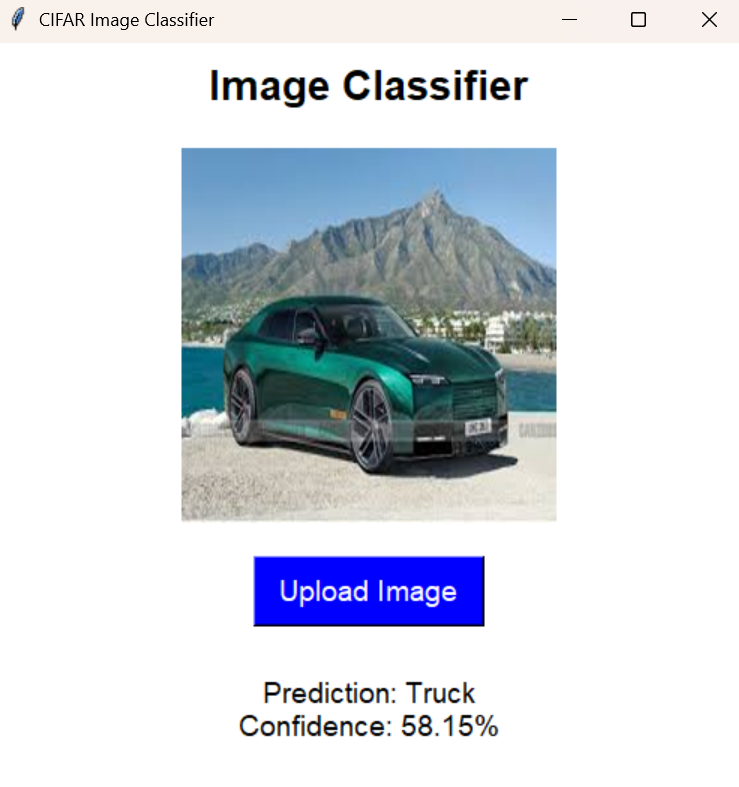
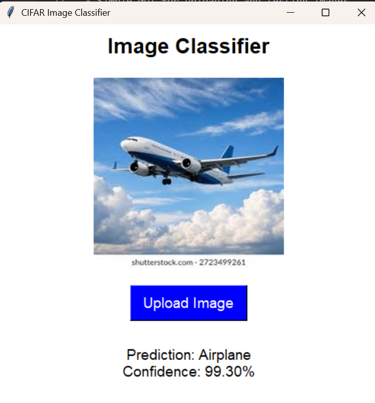

# 🖼️ Image Classification Project

## 📌 Overview
This project implements an image classification system using a Convolutional Neural Network (CNN) trained on the CIFAR dataset.  
It includes:
- A trained model (`model_cifar.h5`)
- A Python GUI (`gui.py`) for easy interaction

## 🚀 Features
- Classifies images into CIFAR categories
- Simple GUI for uploading and testing images
- Pre-trained model for quick predictions

## 🛠️ Installation
Clone the repository and set up the environment:

git clone https://github.com/anushsubba101/ml-learning-journey.git
cd ml-learning-journey/Image-classification
python -m venv venv
source venv/bin/activate   # On Linux/Mac
venv\Scripts\activate      # On Windows
pip install -r requirements.txt

Run the GUI:
'python gui.py'

📂 Project Structure
Image-classification/
│── gui.py              # GUI application
│── model_cifar.h5      # Trained CNN model
│── venv/               # Virtual environment (ignored in repo)
│── requirements.txt    # Dependencies

📸 Demo




# 🖼️ Image Classification Project


## 📌 Overview
This project implements an image classification system using a Convolutional Neural Network (CNN) trained on the CIFAR dataset.  
It includes:
- A trained model (`model_cifar.h5`)
- A Python GUI (`gui.py`) for easy interaction

## 🚀 Features
- Classifies images into CIFAR categories  
- Simple GUI for uploading and testing images  
- Pre-trained model for quick predictions  

## 🛠️ Installation
Clone the repository and set up the environment:

```bash
git clone https://github.com/anushsubba101/ml-learning-journey.git
cd ml-learning-journey/Image-classification
python -m venv venv
source venv/bin/activate   # On Linux/Mac
venv\Scripts\activate      # On Windows
pip install -r requirements.txt
Run the GUI:

bash
python gui.py
📂 Project Structure
Code
Image-classification/
│── gui.py              # GUI application
│── model_cifar.h5      # Trained CNN model
│── venv/               # Virtual environment (ignored in repo)
│── requirements.txt    # Dependencies
│── README.md           # Documentation
│── image.png           # Demo screenshot
│── img2.png            # Demo screenshot
📸 Demo
Here’s how the GUI looks:

[Looks like the result wasn't safe to show. Let's switch things up and try something else!]  
[Looks like the result wasn't safe to show. Let's switch things up and try something else!]

🧠 Model Details
Architecture: Convolutional Neural Network (CNN)

Dataset: CIFAR-10

Accuracy: ~85%

📜 License
This project is licensed under the MIT License.

🔗 Links
GitHub Repository (github.com in Bing)
